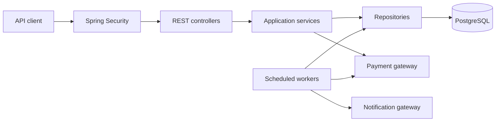
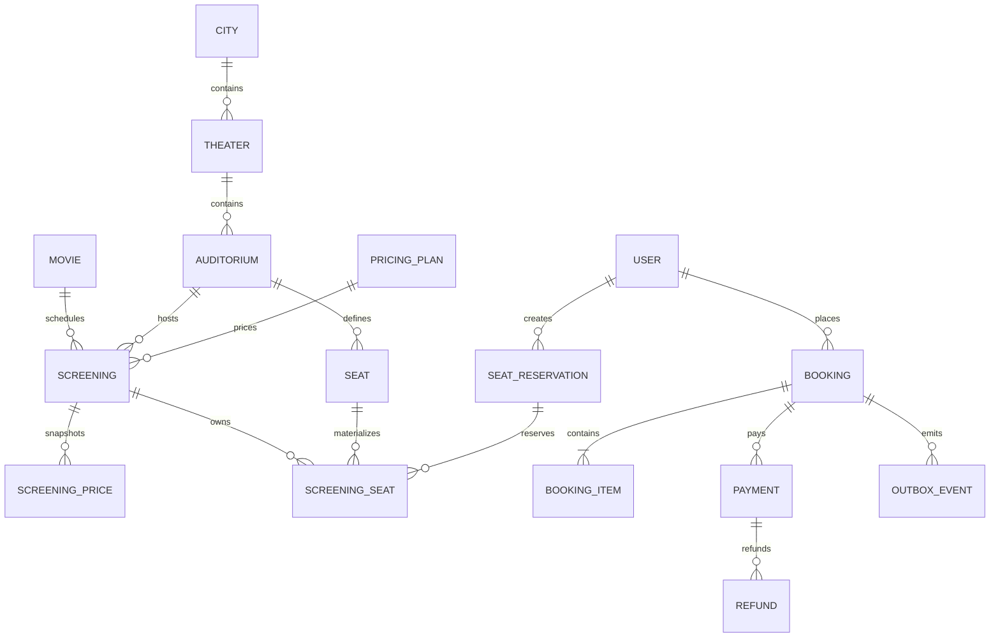
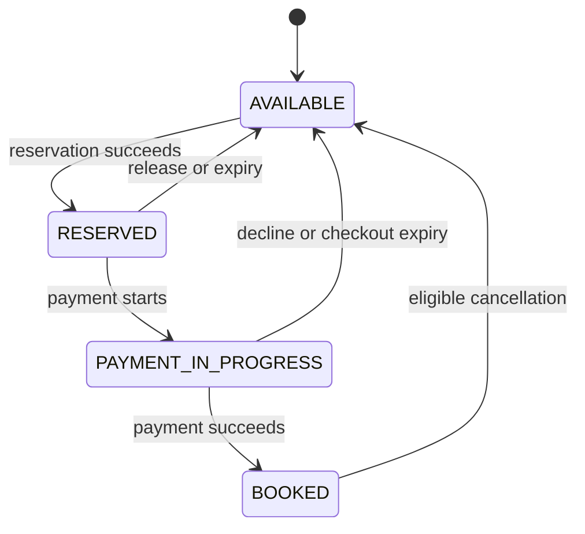

# Movie Ticket Booking System — Design

## 1. Goal

Build a Spring Boot REST API that supports the complete movie-ticket journey: browse screenings, reserve exact seats, pay, confirm a booking, cancel under a refund policy, and deliver confirmation and reminder notifications asynchronously.

The system is a PostgreSQL-backed modular monolith. Its primary guarantee is:

> A seat in a screening can belong to at most one active reservation or confirmed booking.

## 2. Scope

### Customer

- Browse theaters, movies, and screenings by city and date.
- View screening-specific seats, prices, and availability.
- Reserve multiple seats for four minutes.
- Apply an eligible fixed or percentage discount code.
- Pay through a deterministic local payment adapter and confirm a booking.
- View booking details, refund status, and paginated booking history.
- Cancel a complete booking under a configurable refund policy.
- Receive confirmation, cancellation, refund, and reminder notifications through an asynchronous local adapter.

### Administrator

- Manage cities, theaters, auditoriums, and seat layouts.
- Manage movies and scheduled screenings.
- Configure regular and premium prices with a weekend adjustment.
- Configure discount codes and refund policies.
- Activate or deactivate catalog records.

### Not implemented

- UI, deployment, containerization, or CI/CD.
- OAuth, SSO, MFA, or a production identity provider.
- Real payment, email, or SMS providers.
- Partial cancellation, rescheduling, loyalty programs, or demand-based pricing.
- Microservices or other distributed-system infrastructure.

## 3. Local Capacity Target

The system is intended to be developed and demonstrated in 48 hours on one machine with open-source tools.

| Area | Local target |
|---|---:|
| Cities | 3 |
| Theaters | 10 |
| Auditoriums | 30 |
| Seats per auditorium | 150 |
| Screenings per auditorium per day | 4 |
| Future schedule | 7 days |
| Materialized screening-seat rows | about 126,000 |
| Seeded customers | up to 1,000 |
| Booking-history dataset | up to 10,000 bookings |
| Same-seat concurrency check | 25 simultaneous attempts; exactly one succeeds |
| API page size | default 20, maximum 100 |
| Worker batch size | 100 records |

## 4. Technology Choices

| Concern | Choice | Reason |
|---|---|---|
| Runtime | Java 21 | LTS Java baseline with mature tooling |
| Framework | Spring Boot | Provides REST, validation, security, transactions, and scheduling |
| Build | Maven | Conventional and reproducible Spring Boot build |
| Database | PostgreSQL | ACID transactions, row locks, constraints, and relational queries fit seat booking |
| Migrations | Flyway | Reviewable schema changes; Hibernate validates rather than creates schema |
| Persistence | Spring Data JPA with explicit locking queries | Fast CRUD development with control over contested queries |
| API contract | springdoc-openapi | Generates OpenAPI from implemented controllers and DTOs |
| Tests | JUnit 5 and Testcontainers PostgreSQL | Exercises the database behavior used by the application |
| External integrations | Local gateway adapters | Deterministic payment and notification behavior without credentials or network access |

PostgreSQL is used instead of a document or key-value store because a reservation must atomically update several related seat rows. PostgreSQL integration tests are used instead of H2 because locking and SQL behavior must match the application database.

## 5. Architecture



### Modules

```text
identity      users, credentials, ADMIN/CUSTOMER roles
catalog       cities, theaters, auditoriums, seats, movies
screening     scheduling, pricing, screening-seat inventory, browsing
reservation   temporary seat reservations and expiry
booking       checkout, confirmation, history, cancellation
payment       payments, refunds, and local adapter
notification  outbox, confirmations, reminders, and local adapter
shared        errors, time, identifiers, and pagination
```

Dependency direction inside every module is:

```text
Controller -> Service -> Repository/Gateway -> Model/Database
```

- Controllers validate HTTP input and map responses.
- Services enforce authorization, business rules, state transitions, and transactions.
- Repositories own queries, pagination, and row locks.
- Gateways isolate payment and notification adapters.

Spring Security uses database-backed BCrypt credentials and the authorities `ROLE_ADMIN` and `ROLE_CUSTOMER`. Browse endpoints are public; reservation, booking, cancellation, refund, and history endpoints require `ROLE_CUSTOMER`; `/admin/api/v1/**` requires `ROLE_ADMIN`.

## 6. Design Decisions

### 6.1 Materialize inventory per screening

Creating a `Screening` creates one `ScreeningSeat` (`screening_seat`) for every active physical `Seat` in its auditorium. A physical `Seat` describes a permanent location such as Row G, Seat 10. A `ScreeningSeat` is that seat's sellable inventory for one scheduled screening.

`screening_seat` is the lock target and availability source. A unique `(screening_id, seat_id)` constraint prevents duplicate inventory.

Screening creation and schedule changes lock the parent auditorium row before checking for overlapping active screenings and writing the schedule. This serializes competing admin requests for the same auditorium; adjacent time ranges remain valid.

### 6.2 Serialize seat reservations with ordered row locks

Before locking, the service rejects duplicate IDs and sorts the requested `screeningSeatIds` in ascending order. It acquires PostgreSQL `FOR UPDATE` locks in that order, validates every seat, and updates all seats or none.

Therefore requests `[10, 11]` and `[11, 10]` both attempt locks as `[10, 11]`, preventing a circular wait. All code paths use the same lock order. PostgreSQL deadlock SQL state `40P01` is retried outside the failed transaction at most three times with short jitter; the operation remains safe because it is idempotent.

Transactions remain short and never contain payment or notification calls.

### 6.3 Use a four-minute reservation

`booking.reservation-duration=PT4M` controls the reservation period. A reservation in `ACTIVE` state is effectively expired when `expires_at <= now`, even if cleanup has not yet changed its stored state. Services capture `now` once from the injected `Clock` and pass it to repository predicates so tests and transactions use the same instant.

Payment can begin only when at least 30 seconds remain. Starting payment changes the reservation to `PAYMENT_IN_PROGRESS` with a one-minute checkout lease (`booking.checkout-duration=PT1M`); that lease supersedes the original reservation deadline. An `ACTIVE` reservation expires at `expires_at`, while `PAYMENT_IN_PROGRESS` expires at `checkout_expires_at`. A batch worker cleans expired reservations and checkouts for housekeeping; correctness does not depend on worker timing.

Checkout expiry releases the seats and marks the pending booking failed. Payment finalization must recheck the lease and current seat ownership under the same row locks used for reservations. A late gateway success cannot confirm a booking after the lease expires. Instead, the succeeded payment is recorded and one idempotent compensating refund is queued; another customer's seat ownership is never changed.

### 6.4 Calculate and snapshot INR pricing

- The only supported currency is Indian rupees (`INR`, displayed as `₹`).
- Money uses `BigDecimal`; database amounts use `NUMERIC(12,2)`.
- A pricing plan defines `REGULAR` and `PREMIUM` base prices plus a weekend adjustment.
- Screening creation uses the theater's local time zone to determine weekday/weekend and writes final category prices to `ScreeningPrice`.
- Booking items snapshot the final price; bookings, payments, and refunds store `INR` for audit clarity.
- Discount codes support fixed and percentage reductions with validity, minimum spend, usage limits, and an optional cap.
- At checkout, the booking stores immutable copies of its refund-policy cutoff and percentage rules. Later admin edits affect only later bookings.

### 6.5 Isolate local external providers

`PaymentGateway` accepts a stable idempotency key and returns success or decline. The local adapter recognizes deterministic test tokens. `NotificationGateway` records local deliveries.

Booking, cancellation, and refund transactions write `OutboxEvent` rows. Workers deliver those events later, so notification work never blocks or rolls back the primary request.

## 7. Data Model

| Entity | Purpose and important constraints |
|---|---|
| `User` | Unique email, BCrypt password, `ADMIN` or `CUSTOMER`, active flag |
| `City` | Name, country, time zone, active flag |
| `Theater` | City, name, address, active flag |
| `Auditorium` | Theater, name, active flag; unique within theater |
| `Seat` | Auditorium, row, number, `REGULAR`/`PREMIUM`; unique position |
| `Movie` | Title, duration, language, active flag |
| `PricingPlan` | Regular price, premium price, weekend adjustment, active flag |
| `Screening` | Movie, auditorium, start/end, status, pricing plan, refund policy |
| `ScreeningPrice` | Screening, seat category, final INR amount; unique per category |
| `ScreeningSeat` | Screening, seat, state, reservation owner/expiry, booking owner; unique screening and seat |
| `SeatReservation` | Customer, screening, state, expiry, checkout expiry, idempotency key |
| `Booking` | Reference, customer, screening, reservation, state, subtotal, discount, total, `INR` |
| `BookingItem` | Booking, screening seat, seat/category snapshot, final price |
| `BookingRefundRule` | Immutable booking-specific cutoff/percentage snapshot used at cancellation |
| `Payment` | Booking, idempotency key, INR amount, state, local provider reference |
| `DiscountCode` | Code, type, value, validity, limits, active flag |
| `DiscountRedemption` | Discount, customer, booking, awarded amount |
| `RefundPolicy` | Named policy with ordered cutoff/percentage rules |
| `Refund` | Booking, payment, INR amount, cancellation or late-payment reason, state, idempotency key; unique per payment and reason |
| `OutboxEvent` | Event type, aggregate ID, payload, state, next attempt, attempt count |



## 8. States

### Screening seat



```text
Reservation: ACTIVE -> PAYMENT_IN_PROGRESS | RELEASED | EXPIRED | CONVERTED
Booking: PENDING_PAYMENT -> CONFIRMED | PAYMENT_FAILED
Booking: CONFIRMED -> CANCELLED
Payment: INITIATED -> SUCCEEDED | FAILED
Refund: PENDING -> PROCESSING -> SUCCEEDED | FAILED
```

Only the listed transitions are permitted. Retrying a completed idempotent operation returns its existing result.

## 9. OpenAPI REST Contract

All APIs use JSON. springdoc-openapi exposes `/v3/api-docs` and `/swagger-ui.html`. The generated contract documents authentication, validation, pagination, `Idempotency-Key`, status codes, and error schemas, and is verified by integration tests.

### Public and customer APIs

| Method and path | Access | Purpose |
|---|---|---|
| `GET /api/v1/cities` | Public | List active cities |
| `GET /api/v1/theaters?cityId=` | Public | List theaters in a city |
| `GET /api/v1/movies?cityId=&date=&cursor=` | Public | Browse available movies |
| `GET /api/v1/movies/{movieId}` | Public | Movie details |
| `GET /api/v1/screenings?cityId=&movieId=&theaterId=&date=&cursor=` | Public | Find screenings |
| `GET /api/v1/screenings/{screeningId}` | Public | Screening and price summary |
| `GET /api/v1/screenings/{screeningId}/seats` | Public | Seat layout and effective availability |
| `POST /api/v1/seat-reservations` | Customer | Atomically reserve selected `screeningSeatIds` |
| `GET /api/v1/seat-reservations/{reservationId}` | Customer | View own reservation and expiry |
| `DELETE /api/v1/seat-reservations/{reservationId}` | Customer | Release own reservation idempotently |
| `POST /api/v1/bookings` | Customer | Pay and confirm from a reservation |
| `GET /api/v1/bookings/{bookingId}` | Customer | View own booking |
| `GET /api/v1/bookings?cursor=&limit=` | Customer | Paginated booking history |
| `POST /api/v1/bookings/{bookingId}/cancellations` | Customer | Cancel and create refund idempotently |
| `GET /api/v1/refunds/{refundId}` | Customer | View own refund state |

Reservation, booking, and cancellation creation require `Idempotency-Key`.

### Administrator APIs

`/admin/api/v1/**` requires `ROLE_ADMIN`:

```text
/admin/api/v1/cities
/admin/api/v1/theaters
/admin/api/v1/theaters/{theaterId}/auditoriums
/admin/api/v1/auditoriums/{auditoriumId}/seats
/admin/api/v1/movies
/admin/api/v1/pricing-plans
/admin/api/v1/screenings
/admin/api/v1/screenings/{screeningId}/prices
/admin/api/v1/discount-codes
/admin/api/v1/refund-policies
```

Creating a screening rejects auditorium schedule overlap and materializes screening seats and final weekday/weekend prices in one transaction.

### Error response

Errors use RFC 9457 Problem Details with content type `application/problem+json`:

```json
{
  "type": "/problems/seat-unavailable",
  "title": "Seat unavailable",
  "status": 409,
  "detail": "One or more requested seats are no longer available.",
  "instance": "/api/v1/seat-reservations",
  "code": "SEAT_UNAVAILABLE",
  "requestId": "01K...",
  "fieldErrors": [
    {
      "field": "screeningSeatIds[1]",
      "code": "UNAVAILABLE",
      "message": "The selected seat is no longer available."
    }
  ]
}
```

Use `400` for malformed input, `401` unauthenticated, `403` unauthorized, `404` missing or concealed, `409` state/idempotency conflict, `422` business-rule violation, and `500` unexpected failure. Responses never expose stack traces, SQL, database details, payment tokens, or provider internals.

## 10. Core Flows

### 10.1 Reserve, release, and expire seats

1. Authenticate a customer and validate the screening and bounded seat list.
2. Reject duplicate IDs; sort IDs ascending.
3. Return the stored result when the same idempotency key and request fingerprint already exist.
4. Lock all requested `screening_seat` rows in sorted order.
5. Verify the exact row count, same screening, sales window, and effective availability.
6. Create a four-minute `SeatReservation` and mark every seat `RESERVED`, or roll back all changes.
7. `DELETE` releases the customer's active reservation idempotently.
8. Any operation treats an `ACTIVE` reservation with `expires_at <= now` as expired. A worker later cleans expired rows in batches.
9. Retry PostgreSQL `40P01` deadlocks outside the transaction up to three times.

The availability response is advisory; the locked reservation transaction is authoritative.

### 10.2 Pay and confirm a booking

1. Lock the customer's reservation and seats and require at least 30 seconds remaining.
2. Validate ownership, screening sales window, and idempotency key.
3. Calculate screening-seat prices and discount on the server in INR.
4. Create immutable booking items, `PENDING_PAYMENT` booking, and `INITIATED` payment.
5. Move the reservation/seats to a one-minute `PAYMENT_IN_PROGRESS` lease and commit.
6. Call the local payment gateway outside the database transaction.
7. Lock the booking and seats again.
8. Recheck the checkout lease, reservation state, and seat ownership. If still valid and payment succeeded, atomically mark payment `SUCCEEDED`, seats `BOOKED`, booking `CONFIRMED`, reservation `CONVERTED`, and write a confirmation outbox event.
9. On decline, mark payment/booking failed and release only seats still owned by this reservation.
10. If success arrives after checkout expiry, record the payment success, keep the booking failed, and queue one compensating refund. Never reclaim seats already released or reserved by another customer. Retry/recovery processing resolves a pending payment attempt after a process failure using the gateway's idempotency key.

Repeating the request with the same key returns the original outcome and never creates another payment or booking.

### 10.3 Cancel and refund

1. Lock the confirmed booking and verify customer ownership.
2. Select the matching refund percentage using the booking's immutable policy-rule snapshot and time before screening start.
3. Atomically mark the booking `CANCELLED`, release its seats, create one pending refund, and write cancellation/refund outbox events.
4. A worker invokes the local refund adapter idempotently and records success or terminal failure.

Repeated cancellation returns the existing cancellation and refund.

### 10.4 Deliver notifications and reminders

1. Workers claim outbox rows in batches using `FOR UPDATE SKIP LOCKED`.
2. The local notification adapter records confirmation, cancellation, refund, and reminder deliveries.
3. Retryable failures use bounded attempts and `next_attempt_at`.
4. A scheduled query creates one reminder event per confirmed booking within the configured reminder window; a unique event key prevents duplicates.
